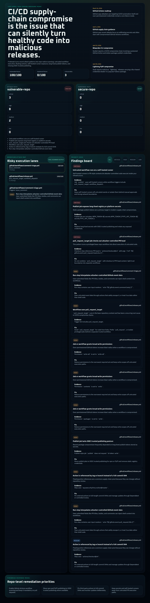
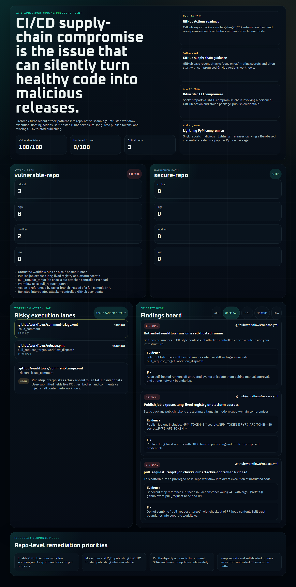

# Supply Chain Firebreak

`supply-chain-firebreak` is a late-April 2026 response repo for the issue that currently feels most acute across the coding world: **software supply-chain compromise through CI/CD workflows and package publishing secrets**.

This repo scans GitHub Actions workflows for patterns tied to recent real-world incidents:

- unsafe `pull_request_target` execution
- unpinned third-party actions
- self-hosted runners in untrusted contexts
- script injection through user-controlled GitHub event fields
- publish jobs powered by long-lived npm or PyPI secrets
- over-broad workflow permissions
- missing OIDC-based trusted publishing
- missing workflow scanning coverage

## Why this issue

As of **May 2, 2026**, the strongest current signal is not “general AI” or “generic bug volume.” It is the **continuing wave of CI/CD and package-registry compromise**:

- GitHub wrote on **April 1, 2026** that recent open-source attacks are focusing on **secret exfiltration** and often start by compromising **GitHub Actions workflows**.
- GitHub’s **March 26, 2026** Actions security roadmap says the pattern is now clear: attackers are targeting **CI/CD automation itself**, not just the software it builds.
- npm expanded **trusted publishing** on **April 6, 2026**, reinforcing the push away from long-lived publish tokens.
- PyPI published its second security audit on **April 16, 2026**, including OIDC and organization-control findings.
- On **April 23, 2026**, Socket reported the Bitwarden CLI compromise through a poisoned GitHub Action in CI/CD.
- On **April 30, 2026**, Snyk documented the malicious `lightning` PyPI releases that used a Bun-based credential stealer.

Research notes and links are collected in [docs/problem-brief.md](docs/problem-brief.md).

## What the repo includes

- Python scanner CLI
- risk model and rule engine
- HTML report generator
- React operator dashboard
- vulnerable and hardened fixture repositories
- CI workflow
- screenshots and audit log

## Screenshots




## Quick Start

### Python

```bash
python -m pip install -e .[dev]
firebreak scan fixtures/vulnerable-repo --repo-name vulnerable-demo --json-out results/vulnerable-report.json --html-out results/vulnerable-report.html
```

### Frontend

```bash
npm install
npm run generate:reports
npm run build:web
npm run preview:web
```

## CLI

```bash
firebreak scan <path> [--repo-name NAME] [--json-out FILE] [--html-out FILE]
```

Example:

```bash
firebreak scan . --json-out results/report.json --html-out results/report.html
```

## Detection Themes

| Rule | What it catches |
|---|---|
| `unsafe-pull-request-target` | privileged workflows that evaluate untrusted PR content |
| `checkout-pr-head-in-target` | `actions/checkout` of PR head in `pull_request_target` |
| `unpinned-third-party-action` | non-local actions referenced by tag or branch instead of full SHA |
| `overbroad-permissions` | `write-all` or excessive job permissions |
| `long-lived-publish-token` | publish jobs using `NPM_TOKEN`, `PYPI_API_TOKEN`, `TWINE_PASSWORD`, etc. |
| `missing-oidc-publish` | publish jobs without `id-token: write` trusted publishing posture |
| `script-injection-user-input` | shell steps interpolating attacker-controlled event fields |
| `self-hosted-untrusted-runner` | self-hosted execution in PR-style contexts |
| `missing-actions-codeql` | no workflow coverage for Actions-oriented scanning |

## Repo Layout

```text
supply-chain-firebreak/
├── apps/web/                 # React dashboard
├── docs/                     # research notes, audit, screenshots
├── fixtures/                 # vulnerable and secure demo repos
├── results/                  # generated JSON and HTML reports
├── src/firebreak/            # Python scanner core
├── tests/                    # scanner tests + browser smoke
├── tools/                    # report generation utilities
└── .github/workflows/        # CI
```

## Verification

The final verification log is kept in [docs/final-audit.md](docs/final-audit.md).

## License

MIT
